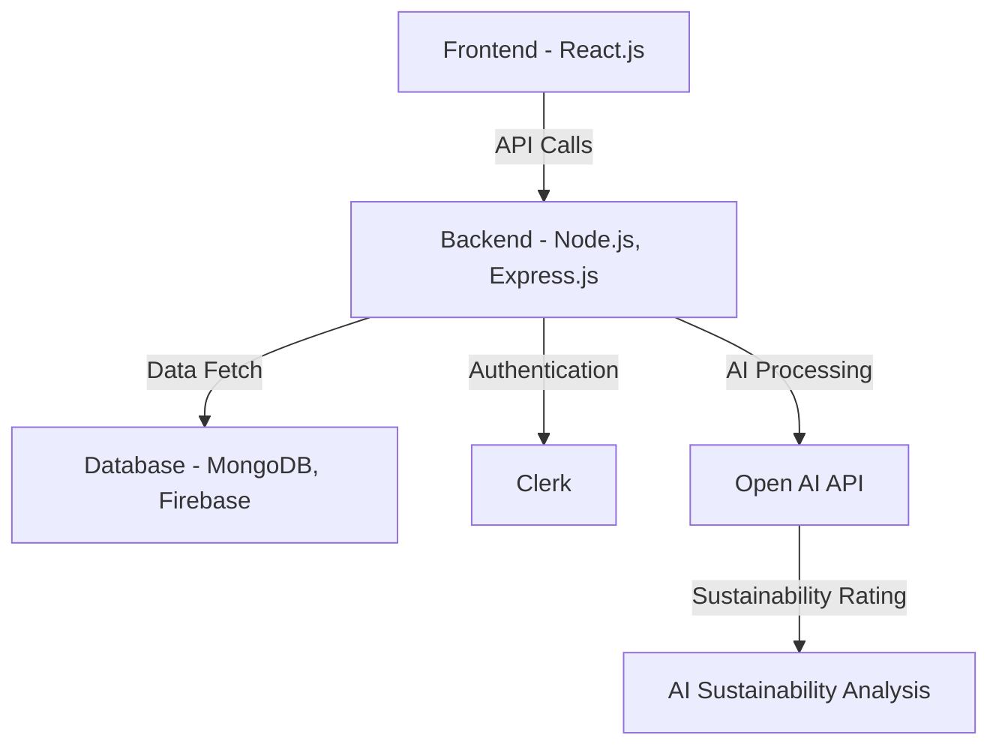

# HowGood - Architecture Documentation

## Overview
This document describes the architecture of the **HowGood** project. It includes an overview of the system components, their interactions, and a visual representation using Mermaid diagrams.

## System Architecture

## Component Breakdown
- **Frontend:** Built using React.js, Tailwind CSS, and ShadCN.
- **Backend:** A Node.js and Express.js API handles business logic.
- **Database:** MongoDB and Firebase store application data.
- **Authentication:** Clerk is used for secure user authentication.
- **AI Integration:** OPEN AI API provides AI-powered sustainability analysis.

## Future Enhancements
- Improve AI processing speed.
- Optimize API calls for better performance.
- Introduce additional AI models for enhanced sustainability insights.
